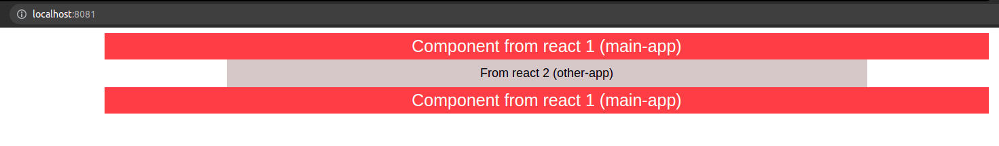

# Micro front-end

#### What is Module Fedaration ?

- This is a design approach the splits the coding task into multiple independent frontend applications. It offers managable, independent and maintained code. Using this architecture development of each application can be done seperately without bothering the development of other applications
- **Pros**
  - Smoother transition CI / CD
  - Stack for rach App and can have different version of each application
  - No code sharing between application ( this can lead to problems while scaling )
  - Can Use Other / Latest stack to deply features independently
- **cons**
  - Having same look and feel is a bit difficult as multiple teams has been involved.
  - Duplicate code can be downloaded from different applications.
  - Application performance might be slower than a complete Angular / react application.
  - Managing SEO will be difficult.

## 1. Using NPM

#### In the below demo two independent react applications are used [ Any frontend framework can be choose ]

- To create the first front-end application run the following command

```cmd
> npm create-mf-app app_name       # here app name is main-app
```

- When we run the above commond terminal asks about the frontend framework, javaScript or TypeScript and about the inbuilt support for the tailwind css ( which is very popular nowadays)

following frameworks are supported by npm for module federation ( you can choose any framework of you choice)

```cmd
1. React
2. SolidJs
3. VannilaJS
4. Vue2
5. Vue3
6. preact
```

```cmd
pick the name of the app ? (host) [ Enter name here ]
```

- Enter the port number for the application [ while chosing chose different port numbers for different applications ]
- After that it will ask about the project type [ select Application]

```cmd
Project type
> Application       # select application
> API Server
> Library
```

- This app is reponsible for the header and footer part of the application
- create two components in that application namely `Header.js` and `Footer.js` in the sr folder and rerun the application to initiate the micro-frontend part.
- Similarly, create a another react-application create a another react-application and name it as `other-app` inside of it create a `home.jsx` component to render the home page area

#### Steps to connect both the Application to communicate with each other and share components

This communication is achieved using the feature known as module federation. Using mapping of URLs also this can be achieved but using module fedaration in webpacks.js

- to communicate with each other one of them has to be host and other as their remote applications

- So, here we are `main-app` as our host applicaiotn and 'other-app' as remote app.

- As we are importing two components  namely`header.js` and 'footer.js' from the main-app they will this app's exports. So, we have to mention these components as this app's exposes as follows. In the 'webpack.config.js' file in `main-app` folder add this in the exposes section under `ModuleFedaration` Plugin as follows

  ```javascript
  plugins: [
      new ModuleFederationPlugin({
        name: "main_app",
        filename: "remoteEntry.js",
        remotes: {},
        exposes: {
          "./Header":"./src/Header.jsx" # header component
          "./Footer":"./src/Footer.jsx" # Footer component
        },
        shared: {
          ...deps,
          react: {
            singleton: true,
            requiredVersion: deps.react,
          },
          "react-dom": {
            singleton: true,
            requiredVersion: deps["react-dom"],
          },
        },
      }),
      new HtmlWebPackPlugin({
        template: "./src/index.html",
      }),
    ],
  ```

  

- Now rerun the `main-app` using `npm start` using to start the module fedaration , this basically add a manifest file named `remoteEntry.js` to communicate with another application

- To make the 'other-app' as remote app open its `webpack.config.js` file  and add the remote path  to the `main-app`  in `modulefedaration` plugIn as follows  [ it is a path to `main-app`'s `remoteEntry.js` file ]

  ```javascript
  plugins: [
      new ModuleFederationPlugin({
        name: "other_app",
        filename: "remoteEntry.js",
        remotes: {
          main_app:"main_app@http://localhost:8080/remoteEntry.js" // main_app is the name of the main-app
        },
        exposes: {},
        shared: {
          ...deps,
          react: {
            singleton: true,
            requiredVersion: deps.react,
          },
          "react-dom": {
            singleton: true,
            requiredVersion: deps["react-dom"],
          },
        },
      }),
      new HtmlWebPackPlugin({
        template: "./src/index.html",
      }),
    ],
  ```

- after doing this we can simply import components from the `main-app` in the `other-app` , thus enabling code sharing and re-run both the applicatios to enable `Micro Front-end`.

- Components can be imported as follows

  ```javascript
  #importing from main_app
  import Header from "main_app/Header";
  import Footer from "main_app/Footer";

- **[Attention] ** While importing components from other application don't forgot to import their respective `CSS` files with them in order to maintain consistency throughout the webpage, Also if we have multiple application then make sure to `killall nodes`  to ensure availability of all ports for the applications.

- Sample of the demo explained - 

  

  As in the picture it can be seen that header is from `main-app` and middle-part or the main-conten is from the `other-app` i.e. 2nd react application. 

  Thats how we can achieve **Micro-frontend** using **NPM** and **Module Fedaration**.

## 2. Using Single-SPA Framework

Using Single SPA also we can achieve Micro-frontend ( it is a bit more complex compared to using NPM ).

It allows to build micro-frontend that coexist and can each be written with their own framework.

- Navbar and the landing page is in `react-js`
- 2nd page linked to Navbar is in `Angular-js`

Sample phot the 2nd demo


#### Steps to Achieve Micro-Frontend using Single-SPA

- SPA uses `Babel`  a JavaScript compiler to compile the code and install still run this command in the root directory of the app

  ```cmd
  yarn add --dev @babel/core @babel/preset-env @babel/preset-react @babel/plugin-syntax-dynamic-import @babel/plugin-proposal-object-rest-spread
  ```

  and also create a .barbelrc file and put the following code in it

  ```javascript
  {
    "presets": [
      ["@babel/preset-env", {
        "targets": {
          "browsers": ["last 2 versions"]
        }
      }],
      ["@babel/preset-react"]
    ],
    "plugins": [
      "@babel/plugin-syntax-dynamic-import",
      "@babel/plugin-proposal-object-rest-spread"
    ]
  }
  ```

- webpack pugin are required for the development server and to load single html file, To do that run following commands in the root directory

  ```cmd
  # Webpack core
  yarn add webpack webpack-dev-server webpack-cli --dev
  # Webpack plugins
  yarn add clean-webpack-plugin --dev
  # Webpack loaders
  yarn add style-loader css-loader html-loader babel-loader --dev
  ```

   Also create a webpack.config.js file to setup the entry points and define loaders.  webpack.config.js file should be like below

  ```javascript
  const path = require('path');
  const webpack = require('webpack');
  const { CleanWebpackPlugin } = require('clean-webpack-plugin');
  
  module.exports = {
    mode: 'development',
    entry: {
      // Set the single-spa config as the project entry point
      'single-spa.config': './single-spa.config.js',
    },
    output: {
      publicPath: '/dist/',
      filename: '[name].js',
      path: path.resolve(__dirname, 'dist'),
    },
    module: {
      rules: [
        {
          // Webpack style loader added so we can use materialize
          test: /\.css$/,
          use: ['style-loader', 'css-loader'],
        },
        {
          test: /\.js$/,
          exclude: [path.resolve(__dirname, 'node_modules')],
          loader: 'babel-loader',
        },
        {
          // This plugin will allow us to use AngularJS HTML templates
          test: /\.html$/,
          exclude: /node_modules/,
          loader: 'html-loader',
        },
      ],
    },
    node: {
      fs: 'empty',
    },
    resolve: {
      modules: [path.resolve(__dirname, 'node_modules')],
    },
    plugins: [
      // A webpack plugin to remove/clean the output folder before building
      new CleanWebpackPlugin(),
    ],
    devtool: 'source-map',
    externals: [],
    devServer: {
      historyApiFallback: true,
    },
  };
  ```

- Add scipts to run the application in the package.json file in the root directory

  ```json
  "scripts": {
    "start": "webpack-dev-server --open",
    "build": "webpack --config webpack.config.js -p"
  }
  ```

- create and HTML file to render all the content and all scripts & stylesheets

  ```html
  <html>
    <head>
      <!-- Materialize -->
      <link
        rel="stylesheet"
        href="https://cdnjs.cloudflare.com/ajax/libs/materialize/0.97.8/css/materialize.min.css"
      />
      <link
        href="https://fonts.googleapis.com/icon?family=Material+Icons"
        rel="stylesheet"
      />
    </head>
    <body>
      <div id="navBar"></div>
      <div id="home"></div>
      <div id="angularJS"></div>
  
      <!-- jQuery -->
      <script src="https://cdnjs.cloudflare.com/ajax/libs/jquery/3.1.1/jquery.min.js"></script>
      <!-- Materialize -->
      <script src="https://cdnjs.cloudflare.com/ajax/libs/materialize/0.97.8/js/materialize.min.js"></script>
      <!-- import the single-spa config file -->
      <script src="/dist/single-spa.config.js"></script>
    </body>
  </html>
  ```

- Create a single-spa.config.js file in the root directory which will tell when and how to `bootstrap`, `mount` and `unmount` an application

  - `registerApplication()` is used to register the app and it has `name`, `loadingFunction()` and an `activityFunction()` as parameters
  - `loadingFunction` will be called while loading the application.This function does not have any arguments

- Create a home application by creating a another folder in src and named it as `home` & create two extraa files in it using the below command

  ```cmd
  touch home.app.js root.component.js
  ```

- Install `react` and `react-router-dom` 

  ```cmd
  yarn add react react-dom single-spa-react react-router-dom react-transition-group
  ```

- Now define home app lifecycles in `home.app.js`

  ```javascript
  import React from 'react';
  import ReactDOM from 'react-dom';
  import singleSpaReact from 'single-spa-react';
  import Home from './root.component.js';
  
  function domElementGetter() {
    return document.getElementById('home');
  }
  
  const reactLifecycles = singleSpaReact({
    React,
    ReactDOM,
    rootComponent: Home,
    domElementGetter,
  });
  
  export const bootstrap = [reactLifecycles.bootstrap];
  
  export const mount = [reactLifecycles.mount];
  
  export const unmount = [reactLifecycles.unmount];
  ```

- Now bult the **react** application in `root.component.js` as per in the github repository

- Also, create a navbar app using react as per in the githu repo.

- Now, create angular application in src using

  ```cmd
  mkdir src/angularJS
  cd src/angularJS
  touch angularJS.app.js root.component.js root.template.html routes.js app.module.js gifs.component.js gifs.template.html
  ```

  Also, add single-spa in angular-js

  ```cmd
  yarn add angular angular-ui-router single-spa-angularjs
  ```

- Now, register the angular application by adding the following code in the `single-spa.config.js` file

  ```cmd
  registerApplication(
    'angularJS',
    () => import('./src/angularJS/angularJS.app.js'),
    () => {},
  );
  ```

- Setup lifecycle for angular application in `angularJS.config.js`

  ```cmd
  import singleSpaAngularJS from 'single-spa-angularjs';
  import angular from 'angular';
  import './app.module.js';
  import './routes.js';
  
  const domElementGetter = () => document.getElementById('angularJS');
  
  const angularLifecycles = singleSpaAngularJS({
    angular,
    domElementGetter,
    mainAngularModule: 'angularJS-app',
    uiRouter: true,
    preserveGlobal: false,
  });
  
  export const bootstrap = [angularLifecycles.bootstrap];
  
  export const mount = [angularLifecycles.mount];
  
  export const unmount = [angularLifecycles.unmount];
  ```

- setup other angular templates as in a normal angular component to setup the angular spa-application. Code as per in the repository

  - `app.module.js`

    ```javascript
    import angular from 'angular';
    import 'angular-ui-router';
    
    angular.module('angularJS-app', ['ui.router']);
    ```

  - `root.component.js`

    ```javascript
    import angular from 'angular';
    import template from './root.template.html';
    
    angular.module('angularJS-app').component('root', {
      template,
    });
    ```

  - `root.template.html`

    ```html
    <div ng-style="vm.styles">
      <div class="container">
        <div class="row">
          <h4 class="light">
            Angular 1 example
          </h4>
          <p class="caption">
            This is a sample application written with Angular 1.5 and
            angular-ui-router.
          </p>
        </div>
        <div>
          <!-- These Routes will be set up in the routes.js file -->
          <a
            class="waves-effect waves-light btn-large"
            href="/angularJS/gifs"
            style="margin-right: 10px"
          >
            Show me cat gifs
          </a>
          <a
            class="waves-effect waves-light btn-large"
            href="/angularJS"
            style="margin-right: 10px"
          >
            Take me home
          </a>
        </div>
        <div class="row">
          <ui-view />
        </div>
      </div>
    </div>
    ```

  - `gif.component.js`

    ```javascript
    import angular from 'angular';
    import template from './gifs.template.html';
    
    angular.module('angularJS-app').component('gifs', {
      template,
      controllerAs: 'vm',
      controller($http) {
        const vm = this;
    
        $http
          .get('https://api.giphy.com/v1/gifs/search?q=cat&api_key=dc6zaTOxFJmzC')
          .then(response => {
            vm.gifs = response.data.data;
          })
          .catch(err => {
            setTimeout(() => {
              throw err;
            }, 0);
          });
      },
    });
    ```

  - `gif.template.html`

    ```html
    <div style="padding-top: 20px">
      <h4 class="light">
        Cat Gifs gifs
      </h4>
      <p></p>
      <div ng-repeat="gif in vm.gifs" style="margin: 5px;">
        
      </div>
    </div>
    ```

- Also set up the routes for the angular-app in `route.js` file.

  ```cmd
  import angular from 'angular';
  import './root.component.js';
  import './gifs.component.js';
  
  angular.module('angularJS-app').config(($stateProvider, $locationProvider) => {
    $locationProvider.html5Mode({
      enabled: true,
      requireBase: false,
    });
  
    $stateProvider
      .state('root', {
        url: '/angularJS',
        template: '<root />',
      })
  
      .state('root.gifs', {
        url: '/gifs',
        template: '<gifs />',
      });
  });
  ```

  

- Now, run the SPA - application by running `yarn start` command in the root directory.

##### References :

- [Spa-official-website](https://single-spa.js.org/docs/4.x/starting-from-scratch/#:~:text=single%2Dspa%20allows%20you%20to,frameworks%20on%20the%20same%20page.)
- [Micro-frontend by freecodecamp](https://www.youtube.com/watch?v=lKKsjpH09dU&t=484s)
